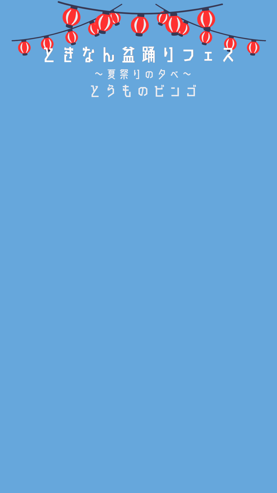

<!DOCTYPE html>
<html lang="ja">
<head>
    <meta charset="UTF-8">
    <meta name="viewport" content="width=device-width, initial-scale=1.0, maximum-scale=1.0, user-scalable=no">
    <title>とうものビンゴ</title>
    
</head>
<body>

    

        上のマスをタップして「うちわスタンプ」を集めよう！ 1列そったら、画面をスタッフにみせてね♬
    

    

        

            
            

        

    

    

        <h2 style="color: #ff4757;">🎆 ビンゴ達成！ 🎆</h2>
        
スタッフにこの画面を見せてね！

    

    
</body>
</html>
